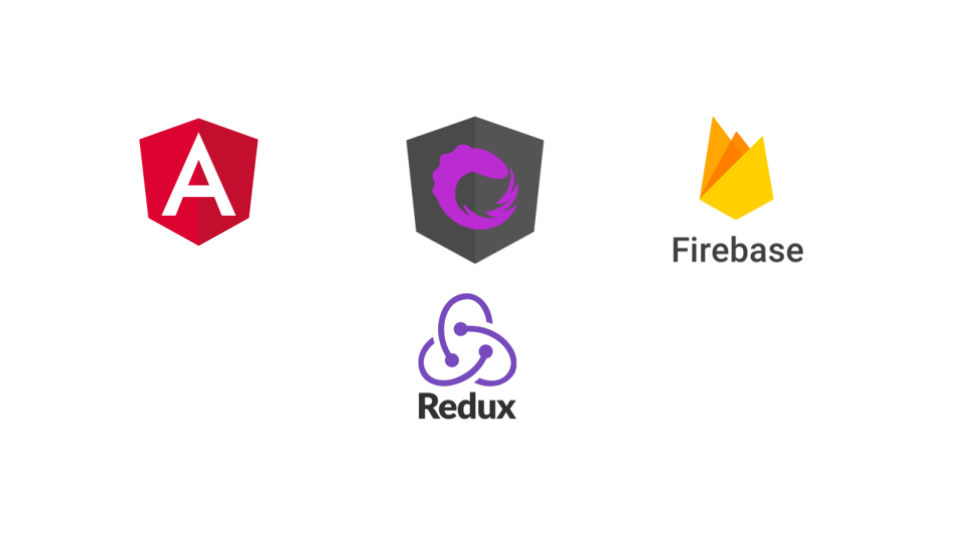
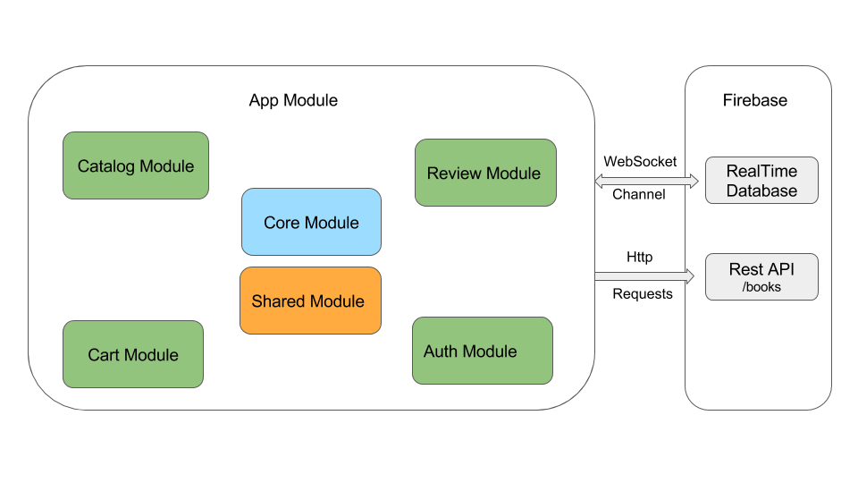
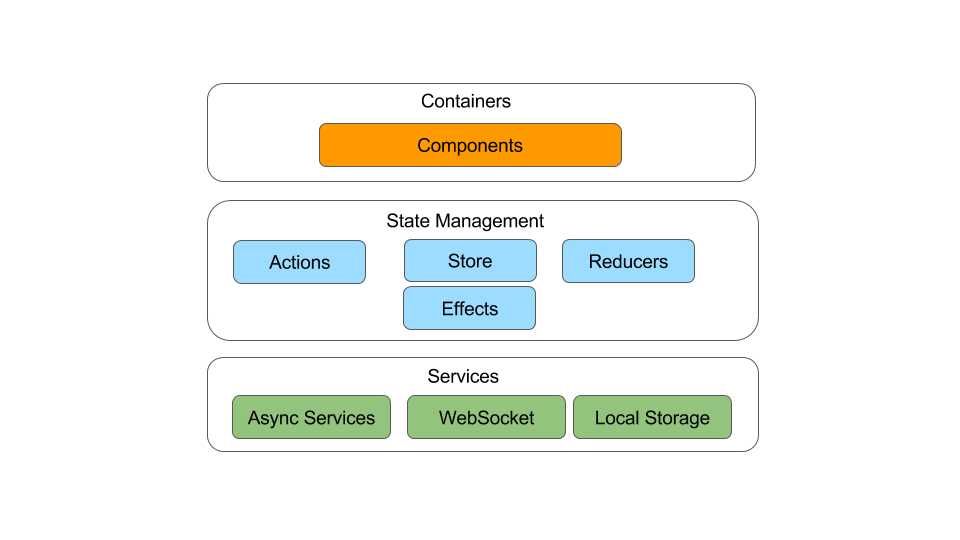

# Reactive Book Store

The aim of this project is to build a modular and scalable application using Angular and Redux. 

A live demo is hosted on Firebase : [https://reactive-book-store.firebaseapp.com](https://reactive-book-store.firebaseapp.com)

Technology Stack : 

* Angular 4
* RxJS 5
* NgRx 4
* Material Design 
* Firebase

The goal of the architecture and structure used in this application is to ensure :

* Scalability
* Modularity
* Separation of concerns ( less logic in the UI )
* Framework agnostic ( Yes The same architecture would be easy to implement in React or Vue)
* Easy for newcomers
* Maintainability ( Redux => Time Traveller Debugger => ) 
* Be Reactive  => Everything should be a stream

This sample application includes the following features : 

* Modular application
* State Management
* Routing
* Lazy loading
* Reactive forms & validations
* Backend communication
* Real Time experience using WebSockets
* Testing
* Material design

# Application Modules 
The application is splitted into several modules. The image below represents the modules implemented in this application.

# Module Architecture
Every module in the application is following the architecture below : 

Each module in the application can be illustrated by  3 big parts : 
* **UI** : represented by containers & components. This is the UI part that will be exported by each module.
* **State Management** : This part will manage the state of the module, dispatching actions and handling side effects.
* **Services** : side effects services like http services, websocket and local storage

Now, let’s dig into each part of this architecture and explain its purpose:

* **Components** 
UI components such as menu, cart item and book navigator. These are dump components, they receive properties and communicate with the outside world via events. The interesting thing about dump components is the fact that they don’t have a state related to our application. It may happen to have a component with an internal state, but this state should not interfere with the application's state.

    Example of Dump components : 

    - [Book Navigator](https://github.com/HaithemMosbahi/book-store/blob/master/src/app/catalog/components/book-navigator/book-navigator.component.ts): it receives current index and the count, and emits events when next and previous are clicked.

* **Containers**
Components that defines the structure of the page are called Containers. They are also known as smart components. Containers are responsible of doing a subscribe to the store of the application in order to feed the dump components when the state of the application changes. Also, they listen to the events emitted by child components and thus dispatch actions to the store.

    Examples of Smart components : 

    - [Selected book container](https://github.com/HaithemMosbahi/book-store/blob/master/src/app/catalog/containers/selected-book.component.ts) : it represents the container of a selected book page, it contains the book navigator component, book details and review container related to that book. This container dispatches actions to load the details of the selected book and subscribe to the store in order to be notified when data has been loaded. Once data is received the container passes the value to its child components.

## Development server

Run `ng serve` for a dev server. Navigate to `http://localhost:4200/`. The app will automatically reload if you change any of the source files.

## Code scaffolding

Run `ng generate component component-name` to generate a new component. You can also use `ng generate directive|pipe|service|class|guard|interface|enum|module`.

## Build

Run `ng build` to build the project. The build artifacts will be stored in the `dist/` directory. Use the `-prod` flag for a production build.

## Running unit tests

Run `ng test` to execute the unit tests via [Karma](https://karma-runner.github.io).

## Running end-to-end tests

Run `ng e2e` to execute the end-to-end tests via [Protractor](http://www.protractortest.org/).

## Further help

To get more help on the Angular CLI use `ng help` or go check out the [Angular CLI README](https://github.com/angular/angular-cli/blob/master/README.md).
